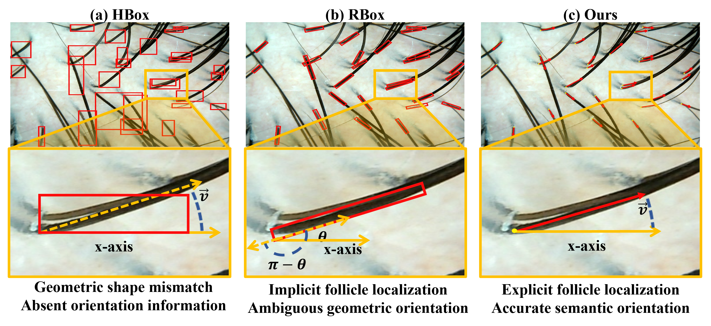
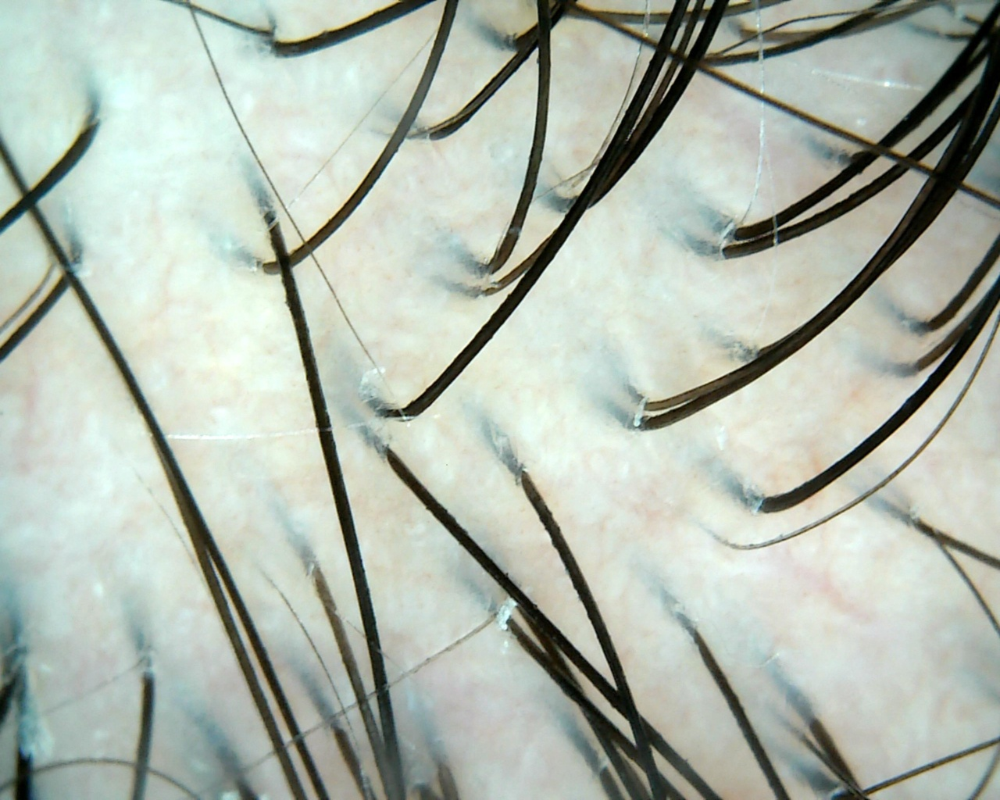
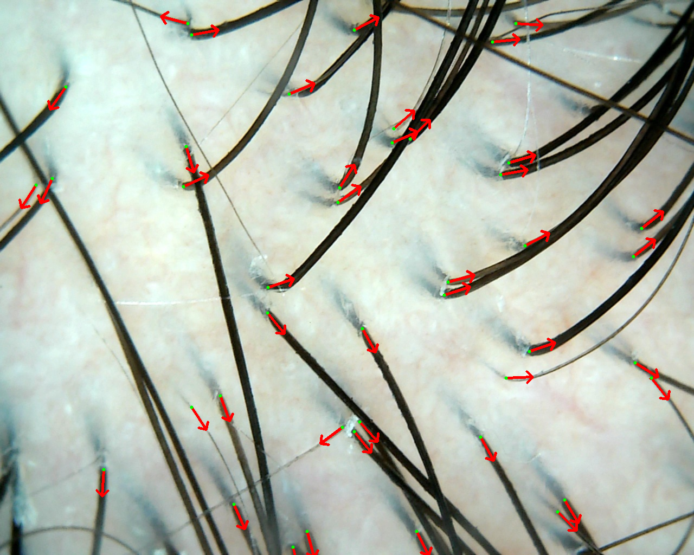

# From Bounding Boxes to Semantic Orientation: Point-Based Follicle Pose Estimation

## Abstract

Accurate estimation of follicle location and hair growth orientation is essential for the image-guided hair transplantation. Most existing trichoscopic analysis approaches rely on bounding box-based approaches, which only provide coarse spatial localization and infer orientation from region geometry rather than the semantic growth direction of hair. Such representations are flawed in challenging scenarios involving occlusion and hair crossings. To address these issues, we reformulate follicle analysis as a point-based pose estimation problem and propose a Follicular Point–Orientation (FPO) representation, in which each follicle is explicitly modeled by a spatial point and an associated unit orientation vector. This formulation decouples localization from bounding-box geometry and enables a compact, semantically grounded description of follicle pose. Based on FPO, we develop a joint follicle position–orientation estimation framework (FPO-Net) for the joint estimation of follicle position and growth direction in trichoscopic images. Experiments on three trichoscopic datasets demonstrate that the proposed point and orientation formulation consistently outperforms rotated bounding boxes methods in both localization precision and orientation estimation. 

## Overview


*Comparisons between representations based on bounding boxes and ours.*

## Keywords

- Hair follicle detection
- Hair transplantation
- Hair orientation estimation
- Oriented object detection

## Code

### � Coming Soon

The complete source code, including the full model implementation and pretrained weights, will be publicly released after paper acceptance.

### 📦 Currently Available

We provide the **model components** to demonstrate our approach:

- ✅ **ADA Module** - Adaptive Direction Aware Module with dynamic gating
- ✅ **Output Heads** - Heatmap, Vector, and Offset prediction heads

## FPO Representation

### Overview

The FPO representation describes each follicle instance using a **point-vector** format, where:
- **Point** (`center`): The 2D coordinates of the follicle opening
- **Vector** (`direction`): The semantic growth direction as a unit vector

### Annotation Example

<table>
  <tr>
    <td align="center">
      <br/>
      <b>Original Trichoscopic Image</b>
    </td>
    <td align="center">
      <br/>
      <b>FPO Annotation Visualization</b>
    </td>
  </tr>
</table>

*Left: Original trichoscopic image. Right: FPO annotations with follicle locations (circles) and growth directions (arrows). See [`annotations/4.json`](annotations/4.json) for the complete annotation data.*

### JSON Structure

Each annotation file contains:

```json
{
  "num_detections": 43,           // Total number of follicles in the image
  "image_size": [1024, 1280],     // [height, width] of the image
  "detections": [                 // Array of follicle instances
    {
      "center": [826.24, 520.96], // Follicle location (x, y) in pixels
      "direction": {
        "cos": 0.9676,            // x-component of unit vector (vx)
        "sin": -0.2525,           // y-component of unit vector (vy)
        "angle_rad": -0.2553,     // Angle in radians
        "angle_deg": -14.63       // Angle in degrees
      }
    },
    // ... more detections
  ]
}
```

### Field Descriptions

| Field | Type | Description |
|-------|------|-------------|
| `num_detections` | int | Total number of follicle instances |
| `image_size` | [int, int] | Image dimensions [height, width] |
| `center` | [float, float] | Follicle location [x, y] in pixel coordinates |
| `cos` | float | x-component of growth direction (vx), normalized to unit length |
| `sin` | float | y-component of growth direction (vy), normalized to unit length |
| `angle_rad` | float | Growth angle in radians, range: [-π, π] |
| `angle_deg` | float | Growth angle in degrees, range: [-180°, 180°] |

